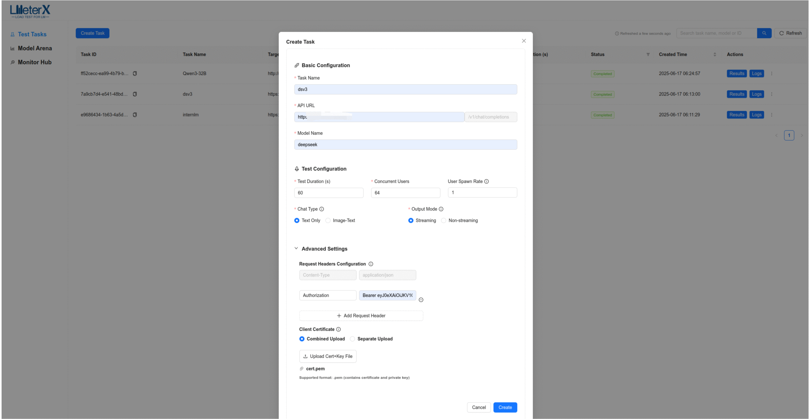
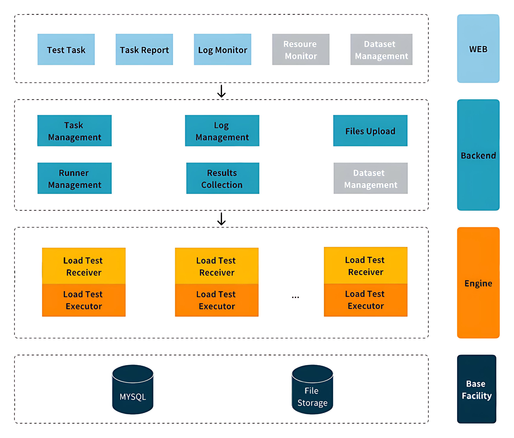

<div align="center">
  
  <p>
    <a href="https://github.com/MigoXLab/LMeterX/blob/main/LICENSE"></a>
    <a href="https://github.com/MigoXLab/LMeterX/stargazers"></a>
  <a href="https://github.com/MigoXLab/LMeterX/network/members"></a>
  <a href="https://github.com/MigoXLab/LMeterX/issues"></a>
    <a href="https://deepwiki.com/MigoXLab/LMeterX"></a>
  </p>
  <p>
    <strong>简体中文</strong> |
    <a href="README.md">English</a>
  </p>
</div>

# LMeterX

## 📋 项目简介

LMeterX 是一个专业的大语言模型性能测试平台，支持基于大模型推理框架（如 LiteLLM、vLLM、TensorRT-LLM、LMDeploy 等）的模型推理服务，同时也支持对 Azure OpenAI、AWS Bedrock、Google Vertex AI 等主流云服务进行性能测试。通过直观的 Web 界面，可以轻松创建和管理测试任务，实时监控测试过程，并获得详细的性能分析报告，为模型部署和性能优化提供可靠的数据支撑。


<div align="center">
  
</div>

## ✨ 核心特性

- **通用框架支持** - 兼容主流推理框架（vLLM、LiteLLM、TensorRT-LLM）和云服务（Azure、AWS、Google Cloud）
- **全模型兼容** - 支持 GPT、Claude、Llama 等主流大模型，一键发起压测
- **高负载压测** - 模拟高并发请求，精准探测模型性能极限
- **多场景覆盖** - 支持流式/非流式、文本/多模态/自定义数据集<sup></sup>
- **专业指标统计** - 首Token延迟、吞吐量(RPS、TPS)、成功率等核心性能指标
- **AI智能报告** - AI智能分析报告<sup></sup>，多维度多模型可视化结果对比
- **Web控制台** - 提供任务创建、停止、状态跟踪、全链路日志监控等一站式管理
- **企业级部署** - Docker容器化，支持弹性扩展与分布式部署

## 🏗️ 系统架构

LMeterX 采用微服务架构，由四个核心组件构成：

- **后端API服务** - FastAPI REST API，负责任务管理和数据存储
- **压测引擎** - Locust负载测试引擎，执行性能测试任务
- **前端界面** - React + TypeScript + Ant Design 现代化Web界面
- **MySQL数据库** - 存储测试任务、结果数据和配置信息

<div align="center">
  
</div>

## 🚀 快速开始

### 环境要求
- Docker 20.10.0+
- Docker Compose 2.0.0+
- 至少 4GB 可用内存
- 至少 5GB 可用磁盘空间

### 一键部署（推荐）

> **完整部署指南**：查看 [完整部署指南](docs/DEPLOYMENT_GUIDE_CN.md) 了解所有部署方式的详细说明

使用预构建的 Docker 镜像，一键启动所有服务：

```bash
# 一键启动所有服务
curl -fsSL https://raw.githubusercontent.com/MigoXLab/LMeterX/main/quick-start.sh | bash
```

### 使用指南

1. **访问界面**: 打开 http://localhost:8080
2. **创建任务**: 导航至 测试任务 → 创建任务，配置LLM API请求信息、测试数据以及请求响应字段映射
   - 2.1 基础信息: 对于 `/chat/completions` API只需要配置API路径、模型以及响应模式即可，也支持在请求参数中补充完整payload
   - 2.2 数据负载: 根据需要选择内置的纯文本数据集/多模态数据集，也支持自定义JSONL数据或文件等
   - 2.3 字段映射: 配置payload中prompt对应字段路径，以及响应数据中对应模型输出的content、reasoning_content字段路径、usage字段路径等，此字段映射对于使用数据集更新请求参数和正确解析流式/非流式响应至关重要，请注意仔细填写
3. **API测试**: 在 测试任务 → 创建任务，点击基础信息面板的"测试"按钮，快速测试API连通性
   **注意**: 为快速得到API响应，建议使用简单的prompt测试API连通性
4. **实时监控**: 导航至 测试任务 → 日志/监控中心，查看全链路测试日志，排查异常
5. **结果分析**: 导航至 测试任务 → 结果，查看详细性能结果，导出报告
6. **结果对比**: 导航至 模型擂台，选择多个模型或版本进行多维度性能对比
7. **AI分析**: 在 测试任务 → 结果/模型擂台，配置AI分析服务后，支持对单个/多个任务进行智能性能评估

## 🔧 配置说明

### 环境变量

```bash
===  数据库配置 ===
DB_HOST=mysql
DB_PORT=3306
DB_USER=lmeterx
DB_PASSWORD=lmeterx_password
DB_NAME=lmeterx

===  前端配置 ===
VITE_API_BASE_URL=/api

=== 高并发压测 部署要求 ===
# 当并发用户数超过此阈值，系统将自动启用多进程模式（需多核 CPU 支持）
MULTIPROCESS_THRESHOLD: 1000
# 每个子进程至少承载的并发用户数（避免进程过多导致资源浪费）
MIN_USERS_PER_PROCESS: 600
# ⚠️ 重要提示：
#   - 当并发量 ≥ 1000 时，强烈建议启用多进程以提升性能。
#   - 多进程模式依赖多核 CPU 资源，请确保部署环境满足资源要求
deploy:
  resources:
    limits:
      cpus: '2.0'    # 建议至少分配 2 核 CPU（高并发场景建议 4 核或以上）
      memory: 2G     # 内存限制，可根据实际负载调整（推荐 ≥ 2G）
```

## 🤝 开发指南

> 💡 **欢迎贡献**！查看 [贡献指南](docs/CONTRIBUTING.md) 了解详情

### 技术栈

- **后端** - Python + FastAPI + SQLAlchemy + MySQL
- **压测引擎** - Python + Locust + 自定义扩展
- **前端** - React + TypeScript + Ant Design + Vite
- **部署** - Docker + Docker Compose + Nginx


```
LMeterX/
├── backend/          # 后端服务
├── st_engine/        # 压测引擎
├── frontend/         # 前端服务
├── docs/             # 文档
├── docker-compose.yml
└── README_CN.md      # 中文说明
```

### 开发环境搭建

1. **Fork项目** → 克隆到本地
2. **创建分支** → 进行功能开发
3. **代码检查** → 运行 `make all` 确保质量
4. **提交PR** → 遵循约定式提交规范
5. **文档更新** → 为新功能撰写文档

## 🗺️ 发展路线图

### 开发中
- [ ] 支持客户端资源监控

### 规划中
- [ ] CLI 命令行工具
- [ ] 支持 `/v1/embedding` 和 `/v1/rerank` 接口压测

## 📚 相关文档

- [部署指南](docs/DEPLOYMENT_GUIDE_CN.md) - 详细部署说明
- [贡献指南](docs/CONTRIBUTING.md) - 参与开发指南

## 👥 贡献者

感谢所有为 LMeterX 做出贡献的开发者：

- [@LuckyYC](https://github.com/LuckyYC) - 项目维护者 & 核心开发者
- [@del-zhenwu](https://github.com/del-zhenwu) - 核心开发者

## 📄 开源许可

本项目采用 [Apache 2.0 许可证](LICENSE)。

---

<div align="center">

**⭐ 如果这个项目对您有帮助，请给我们一个 Star！您的支持是我们持续改进的动力。**

</div>
